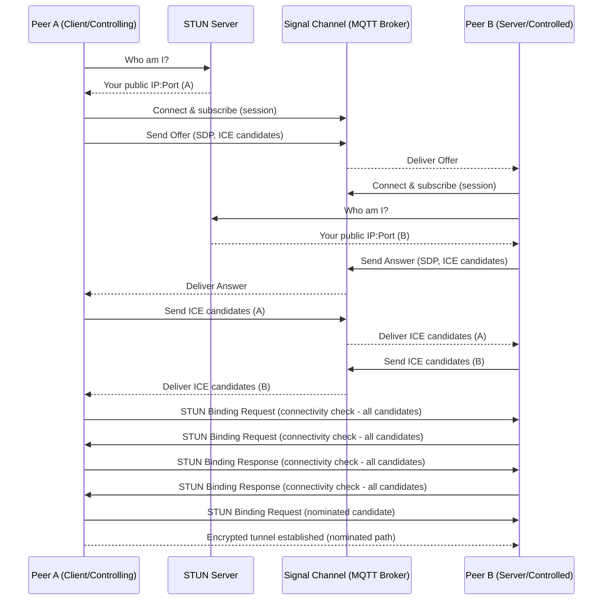

# pig - packet insertion gear


**What is pig?**

pig can connect devices directly to each other, even when they're behind firewalls or routers, automatically finding the best path between two computers.

It works with multiple connection types and doesn't require any special router setup.

## Table of Contents

- [Features](#features)
- [Quick Start](#quick-start)
  - [Scenario 1: Traditional VPN Style](#scenario-1-traditional-vpn-style)
  - [Scenario 2: ICE with WebSocket](#scenario-2-ice-with-websocket)
  - [Scenario 3: Multi-Protocol ICE](#scenario-3-multi-protocol-ice)
- [Transport Protocols](#transport-protocols)
  - [WebSocket](#websocket)
  - [QUIC](#quic)
  - [DTLS](#dtls)
  - [TLS](#tls)
  - [ICMP](#icmp)
  - [TLS-in-ICMP](#tls-in-icmp)
  - [UDP](#udp)
- [Congestion Control](#congestion-control)
- [Configuration Options](#configuration-options)
  - [Command line flags](#command-line-flags)
  - [Configuration File](#configuration-file)
  - [Certificate Handling](#certificate-handling)
- [Authentication](#authentication)
  - [JWT Authentication Example](#jwt-authentication-example)
  - [TLS Mutual Authentication](#tls-mutual-authentication)
  - [Combined Authentication](#combined-authentication)
- [ICE for Direct P2P Connectivity](#ice-for-direct-p2p-connectivity)
  - [Pig's path discovery flow diagram](#pigs-path-discovery-flow-diagram)
  - [Configuring ICE](#configuring-ice)
  - [Allowed ICE Protocols](#allowed-ice-protocols)
  - [Candidate Pair Negotiation](#candidate-pair-negotiation)
  - [STUN Connectivity Checks (RFC 8445 Sections 7.2, 7.3)](#stun-connectivity-checks-rfc-8445-sections-72-73)
- [Start/Stop Scripts](#startstop-scripts)
  - [Configuration](#configuration)
  - [Environment Variables](#environment-variables)
  - [Execution Context](#execution-context)
  - [Example Scripts](#example-scripts)
- [Design Principles](#design-principles)
  - [Unified Interface Design](#unified-interface-design)
  - [Extensible Transport Implementation](#extensible-transport-implementation)
  - [Layered Protocol Stack](#layered-protocol-stack)
  - [Stream Abstraction](#stream-abstraction)
  - [Flow Control](#flow-control-applies-to-icmp-based-transports)
- [Platform Support](#platform-support)
  - [Linux](#linux)
  - [macOS (Darwin)](#macos-darwin)
  - [Windows](#windows)
  - [Certificate Management](#certificate-management)
- [Troubleshooting](#troubleshooting)
  - [Common Issues](#common-issues)
  - [Debug Logging](#debug-logging)
  - [More command line examples](#more-command-line-examples)
- [Contributing](#contributing)
- [License](#license)

## Features

* **Multiple Transport Protocols**: Support for QUIC, UDP, TLS, WebSocket, ICMP, TLS-in-ICMP, and DTLS
* **Automatic Path Discovery**: Direct connections over the internet without router configuration using ICE and UDP/TCP hole punching
* **Advanced ICE Implementation**: Candidate pair negotiation with authenticated STUN binding checks following RFC 8445
* **Cross-Platform Compatibility**: Works on Linux, macOS, and Windows*
* **Security Features**: Automatic self-signed certificate generation, JWT authentication, and TLS mutual authentication
* **Network Optimization**: Congestion control with WRED (Weighted Random Early Detection) and stream multiplexing
* **Flexible Configuration**: Configurable via command line flags or TOML configuration file

_*Windows support is implemented but not extensively tested_

## Quick Start

pig provides three main deployment scenarios, from simple to advanced:

### Scenario 1: Traditional VPN Style
Simple WebSocket tunnel with port forwarding (requires router configuration):

```bash
# Terminal 1 - Server (requires port forwarding on router)
sudo pig -l :443 -proto ws -k

# Terminal 2 - Client
sudo pig -c my.server.net:443 -proto ws -k
```

### Scenario 2: ICE with WebSocket
Automatic NAT traversal using ICE with WebSocket protocol:

```bash
# Terminal 1 - Server (no router configuration needed)
# Bind to inbound port 443 to maximize the chances of a successful connection
sudo pig -l :443 -proto ws -k -ice true

# Terminal 2 - Client
# Note that we are not specifying a port, as ICE will discover it automatically
sudo pig -c my.server.net -proto ws -k -ice true
```

### Scenario 3: Multi-Protocol ICE
Maximum connectivity using all supported protocols, and custom MQTT broker:

```bash
# Terminal 1 - Server (accepts multiple protocol candidates)
sudo pig -l :443 -proto . -k -ice ssl://broker.hivemq.com:8883

# Terminal 2 - Client (tries multiple protocol candidates)
sudo pig -c my.server.net -proto . -k -ice ssl://broker.hivemq.com:8883
```

## Transport Protocols

### WebSocket
* Wraps around [github.com/coder/websocket](https://github.com/coder/websocket)
* Can be used for ICE candidate generation

### QUIC
* Two wrapper implementations are available:
  * `quic-go` - (default) a wrapper around the [quic-go](https://github.com/quic-go/quic-go) QUIC implementation
  * `quic` - a wrapper around the Go standard library QUIC implementation
* Provides native stream multiplexing
* Can be used for ICE candidate generation

### DTLS
* Wraps around [github.com/pion/dtls/v3](https://github.com/pion/dtls/v3)
* Can be used for ICE candidate generation

### TLS
* Direct TLS connection using `crypto/tls`
* Can be used for ICE candidate generation

### ICMP
* Full-featured implementation with packet loss recovery
* Uses raw sockets and `golang.org/x/net/icmp`
* Currently recommended for Linux servers only due to OS-level ICMP handling on other platforms
* Requires OS configuration to prevent interference with ICMP handling (except on Linux)

### TLS-in-ICMP
* Encapsulates TLS traffic within ICMP packets
* Provides additional layer of obfuscation
* Currently recommended for Linux servers only due to OS-level ICMP handling on other platforms
* Requires OS configuration to prevent interference with ICMP handling (except on Linux)
* Can be used for ICE candidate generation but with caveats

### UDP
* Basic UDP implementation
* Lowest overhead

## Congestion Control

pig implements WRED (Weighted Random Early Detection) to combat network bufferbloat and maintain low latency:

* **Proactive Packet Management**: Drops packets before queues become full
* **Traffic Smoothing**: Uses weighted averaging to smooth out traffic bursts
* **Synchronization Prevention**: Prevents global TCP synchronization issues

## Configuration Options

### Command line flags

| Category | Flag | Description | Default |
|----------|------|-------------|---------|
| **Config File** | `-config` | Path to configuration file in TOML or JSON format | |
| **Networks** | `-proto` | Transport protocol, one of "quic", "udp", "tls", "ws", "icmp", "tls-in-icmp", "dtls". Multiple values comma-separated (e.g., "ws,quic") can be used in ICE mode | ws |
| | `-l` | Listen address host[:port] | |
| | `-c` | Connect address host[:port] or server identifier for ICE | |
| | `-mtu` | MTU size | 1400 |
| | `-streams` | Number of multiplexed streams for supported protocols | CPU cores available |
| | `-retry` | Reconnection interval in seconds | 5 |
| | `-I` | Network interface to use (e.g., wlan0, en0) | |
| | `-tunnel` | Tunnel address in CIDR format | 172.31.254.1/32 (client), 172.31.255.1/24 (server) |
| | `-qs` | Size of packet queues | 256 |
| | `-p` | Source port to use for the connection (if applicable) | 0 (system assigned) |
| **WRED** | `-factor` | Weight factor for WRED | 5 |
| | `-drop` | Drop probability | 0.25 |
| | `-thresh` | Queue length threshold | 0.1 |
| **Logging** | `-v` | Verbosity level for logging (0-2, where 2 is most verbose) | 0 |
| **Script** | `-start-script` | Path to script to execute when a tunnel connection is established | |
| | `-stop-script` | Path to script to execute when a tunnel connection is disconnected | |
| **Auth** | `-cert` | Path to certificate file for MTLS | |
| | `-key` | Path to private key file for MTLS | |
| | `-mtls-ca` | Path to a pem formatted certificate bundle containing trusted CAs for MTLS | |
| | `-k` | Disable certificate verification (insecure mode) | |
| | `-auth` | Specify non-tls authentication type to use, currently `jwt` only | |
| | `-tok` | The token to send to the server for applicable auth types | |
| | `-jwk` | Path to public key file used to verify JWT tokens. This can be a local file or a URL. The file can be in PEM or JWKS formats. | |
| **ICE** | `-ice` | Enable ICE based hole punching, set to true (-ice true) to use the default server or provide a MQTT broker address | ssl://test.mosquitto.org:8883 |
| | `-ice-key` | Encryption passphrase for ICE signaling messages | |
| | `-stun-srv` | STUN server address for hole punching | stun.l.google.com:19302 |
| | `-stun-qry` | Source port to query, 'R' for random port | |

### Configuration File

The configuration file supports TOML or JSON. The top-level config now groups most tunnel-related settings under `tunnel`, with dedicated `log` and `route` sections:

| Setting | Type | Description | Default |
|---------|------|-------------|---------|
| `mode` | string | Operating mode: "client" or "server" | Required |
| `start_script` | string | Script to execute when a tunnel connection is established |  |
| `stop_script` | string | Script to execute when a tunnel connection is terminated |  |
| `log.file` | string | Path to log file (optional) |  |
| `log.level` | string | Logging level: "debug", "info", "warn", "error" | info |
| `log.rotate_size` | string/int | Log rotation size (e.g., "100k", "1m", "1g") |  |
| `tunnel.tunnel_address` | string | CIDR format for the tunnel interface (e.g., "10.0.0.1/24") | 172.31.254.1/32 (client), 172.31.255.1/24 (server) |
| `tunnel.proto` | string | Transport protocol: "quic", "udp", "tls", "ws", "icmp", "tls-in-icmp", or "dtls" | ws |
| `tunnel.mtu` | int | Maximum Transmission Unit for the tunnel | 1400 |
| `tunnel.stream_count` | int | Number of multiplexed streams for protocols that support it | CPU cores available |
| `tunnel.queue_size` | int | Size of packet queues | 256 |
| `tunnel.reconnect_interval` | int | Time in seconds to wait before reconnecting | 5 |
| `tunnel.bind_adapter` | string | Network interface to bind to (e.g., "eth0", "wlan0"), useful for icmp based protos | Default interface |
| `tunnel.tls.insecure` | bool | Skip TLS certificate verification if true | false |
| `tunnel.tls.cert_file` | string | Path to TLS certificate file | Auto-generated if empty |
| `tunnel.tls.key_file` | string | Path to TLS private key file | Auto-generated if empty |
| `tunnel.target.address` | string | Target address to bind to (server) or connect to (client) | Required |
| `tunnel.target.port` | int | Port to use for the connection | Required |
| `tunnel.target.src_port` | int | Source port to use for the connection (if applicable) | 0 (system assigned) |
| `tunnel.wred.weight_factor` | float | Weight factor for WRED algorithm | 5.0 |
| `tunnel.wred.drop_probability` | float | Probability of packet drop in WRED | 0.25 |
| `tunnel.wred.threshold` | float | Queue threshold for WRED | 0.1 |
| `tunnel.auth.type` | string | Authentication type: "jwt" | None |
| `tunnel.auth.jwt.public_key_source` | string | Path to public key file, JWKS url, or JSON file with JWK set |  |
| `tunnel.auth.jwt.token` | string | JWT token for client authentication |  |
| `tunnel.auth.mtls.trust_pem` | string | Path to trust bundle for mTLS | System CA |
| `tunnel.auth.mtls.cert_file` | string | Client cert file for mTLS (client only) |  |
| `tunnel.auth.mtls.key_file` | string | Client key file for mTLS (client only) |  |
| `tunnel.ice.enabled` | bool | Enable automatic hole punching | false |
| `tunnel.ice.protos` | array of strings | Protocols to use for ICE candidate generation (e.g. ["ws", "quic"] ), see [Allowed ICE Protocols](#allowed-ice-protocols) for more details | ["ws"] |
| `tunnel.ice.stun_address` | string | STUN server address for hole punching | stun.l.google.com:19302 |
| `tunnel.ice.signaling.encryption_key` | string | Encryption key for signaling messages | no encryption |
| `tunnel.ice.signaling.server_id` | string | Server identifier for connection routing (overrides public IP) | |
| `tunnel.ice.signaling.connect_offset` | int | Connection timing offset in milliseconds for coordinated connections | 500 |
| `tunnel.ice.signaling.mqtt_broker_address` | string | MQTT broker address for signaling | ssl://test.mosquitto.org:8883 |
| `tunnel.ice.signaling.mqtt_client_id` | string | Client ID for MQTT connection | |
| `tunnel.ice.signaling.mqtt_username` | string | Username for MQTT connection | |
| `tunnel.ice.signaling.mqtt_password` | string | Password for MQTT connection | |
| `route.enabled` | bool | Enable custom route management | false |
| `route.tunnel_routes` | array of strings | Routes that will be sent via the tunnel |  |
| `route.bypass_routes` | array of strings | Routes that will be sent via the default gateway |  |

Here's a comprehensive example `config.toml`:

```toml
# Server configuration
mode = "server"                # "server" or "client"
start_script = "/path/to/start.sh" # Script to run when a connection is established
stop_script = "/path/to/stop.sh"   # Script to run when a connection is terminated

[log]
file = "/var/log/pig.log"          # Path to log file (optional)
level = "info"                     # Logging level: debug, info, warn, error
rotate_size = "10m"                # Log rotation size

[tunnel]
tunnel_address = "10.0.0.1/24" # CIDR format for tunnel interface
proto = "quic"                 # "quic", "udp", "tls", "ws", "icmp", "tls-in-icmp", or "dtls"
queue_size = 128               # Size of packet queues for the transport layer
mtu = 1500                     # Maximum Transmission Unit
stream_count = 5               # Number of multiplexed streams for supported protocols
reconnect_interval = 5         # Reconnection interval in seconds
bind_adapter = "eth0"          # Network interface to bind to

  [tunnel.tls]
  insecure = true                # Skip certificate verification if true
  cert_file = "/path/to/cert.pem"
  key_file = "/path/to/key.pem"

  [tunnel.target]
  address = "0.0.0.0"            # Target address to bind to (server) or connect to (client)
  port = 8080                    # Port to use
  src_port = 0                   # Source port (0 for system assigned)

  [tunnel.wred]
  weight_factor = 5.0            # Weight factor for WRED algorithm
  drop_probability = 0.25        # Probability of packet drop
  threshold = 0.1                # Queue threshold for WRED

  [tunnel.auth]
  type = "jwt"                   # Authentication type: "jwt"

    [tunnel.auth.jwt]
    public_key_source = "/path/to/keys.pem" # Path to public key file, URL to JWKS, or JSON file with JWKS
    token = "your.jwt.token"     # JWT token (client only)

    [tunnel.auth.mtls]
    trust_pem = "/path/to/ca.pem" # Path to trust bundle for mTLS
    cert_file = "/path/to/client.pem"
    key_file = "/path/to/client.key"

  [tunnel.ice]
  enabled = true                 # Enable automatic hole punching
  protos = ["ws", "quic", "dtls", "tls"]       # Protocols to use for ICE candidate generation
  stun_address = "stun.l.google.com:19302"  # STUN server address

    [tunnel.ice.signaling]
    encryption_key = "my-secure-passphrase"         # Encryption key for signaling messages
    server_id = "my-server-identifier"              # Server identifier for connection routing
    connect_offset = 500                            # Connection timing offset in milliseconds
    mqtt_broker_address = "ssl://mqtt-broker:8883"  # Optional MQTT broker address, defaults to ssl://test.mosquitto.org:8883
    mqtt_client_id = "unique-client-id"             # Optional MQTT client ID
    mqtt_username = "user"                          # Optional MQTT username
    mqtt_password = "password"                      # Optional MQTT password

[route]
enabled = true
tunnel_routes = ["0.0.0.0/1", "128.0.0.0/1"]
bypass_routes = ["203.0.113.10/32"]
```

Run with config file:
```bash
pig -config config.toml
```

#### Certificate Handling
* If certificate files are not provided, pig automatically generates self-signed certificates
* Use the `-k` flag to skip certificate verification

## Authentication

pig provides multiple authentication mechanisms that can be used independently or combined for enhanced security:

* **JWT Token Authentication**: Client authentication using JWT tokens
* **TLS Mutual Authentication**: Certificate-based mutual authentication for TLS-based protocols (QUIC, TLS, WebSocket)

An interactive signtool is available as part of this project that simplifies JWT token generation and key management, see [JWT Signing Tool Documentation](tools/signtool/README.md).

### JWT Authentication Example

```bash
# Generate a token by running the interactive signtool
./signtool

# Use the token from file via terminal flag
sudo pig -c server:8080 -proto ws -a jwt -tok "$(cat token.txt)"

# Or use it from an environment variable
export PIG_TOKEN="xxx"
sudo pig -c server:8080 -proto ws -a jwt -tok "$PIG_TOKEN"
```

### TLS Mutual Authentication

For TLS-based protocols, you can enable mutual authentication by providing client certificates:

```bash
# Server with mutual TLS authentication
sudo pig -l :8080 -proto tls -cert server.crt -key server.key -mtls-ca ca.crt

# Client with certificate
sudo pig -c server:8080 -proto tls -cert client.crt -key client.key
```

### Combined Authentication

You can combine JWT and TLS mutual authentication for TLS-based protocols:

```bash
# Server with both authentication methods
sudo pig -l :8080 -proto tls \
-cert server.crt -key server.key -mtls-ca ca.crt \
-a jwt -jwk bundle.pem

# Client with both token and certificate
export PIG_TOKEN="xxx"
sudo pig -c server:8080 -proto tls -cert client.crt -key client.key -a jwt -tok "$PIG_TOKEN"
```

## ICE for Direct P2P Connectivity

pig's most powerful feature is its ability to establish direct peer-to-peer connections across NATs and firewalls without any special router setup. This means you don't need to open your applications to the internet.

The ICE mechanism works by:
- **STUN Discovery**: Finding public endpoints through STUN servers
- **MQTT Signaling**: Secure message exchange between peers using MQTT brokers
- **Encrypted Communication**: Optional AES-256-GCM encryption for signaling messages
- **Coordinated Timing**: Synchronized connection attempts using configurable timing offsets
- **Hole Punching**: UDP and TCP hole punching to establish direct connectivity
- **RFC 8445 Compliance**: Candidate pair negotiation with authenticated STUN binding checks

For detailed technical information about pig's ICE implementation, see the [ICE Documentation](pkg/ice/README.md).

### Pig's path discovery flow diagram



### Configuring ICE

ICE can be enabled using the `-ice true` flag or `-ice <broker_addr>`. 

To function properly, ICE requires:
- A MQTT broker address for exchanging signaling messages
- A STUN server address for discovering public endpoints

Fortunately, many public MQTT brokers and STUN servers are available for free. The defaults are `ssl://broker.hivemq.com:8883` for the MQTT broker and `stun.nextcloud.com:443` for the STUN server, but you can use your own services.

Due to the public nature of these services, you can optionally provide a passphrase to encrypt all signaling messages.

**Advanced Configuration Options:**
- **Server ID**: Use `tunnel.ice.signaling.server_id` to identify connections by a custom identifier instead of the server's public IP address
- **Connection Timing**: Configure `tunnel.ice.signaling.connect_offset` (in milliseconds) to coordinate connection attempts between peers, improving NAT traversal success rates

In ICE mode, you can [specify multiple protocols](#allowed-ice-protocols) (e.g. `-proto ws,quic`) to generate candidate pairs. This increases the chances of successful connectivity. 

```bash
# Basic ICE setup with default settings
sudo pig -l . -k -ice true
sudo pig -c my.server.net -k -ice true

# ICE with encryption passphrase
sudo pig -l . -k -ice true -ice-key my-secure-passphrase
sudo pig -c my.server.net -ice true -ice-key my-secure-passphrase

# Advanced ICE with custom settings
sudo pig -l :443 -proto quic -ice ssl://my.broker.org:8883 -stun-srv stun.example.com:3478
sudo pig -c my.server.net -proto quic -ice ssl://my.broker.org:8883 -stun-srv stun.example.com:3478

# Multi-protocol ICE for candidate generation
sudo pig -l :443 -proto ws,quic -k -ice
sudo pig -c my.server.net -proto ws,quic -k -ice

# All supported protocols for maximum connectivity
sudo pig -l :443 -proto . -k -ice true
sudo pig -c my.server.net -proto . -k -ice true
```

The same settings can be configured in the TOML configuration file:

```toml
[tunnel.ice]
enabled = true
protos = ["ws", "quic"]        # Multiple protocols for candidate generation
stun_address = "stun.l.google.com:19302"

[tunnel.ice.signaling]
encryption_key = "my-secure-passphrase"
server_id = "my-server-identifier"
connect_offset = 500
mqtt_broker_address = "ssl://mqtt-broker:8883"
```

### Allowed ICE Protocols

The following protocols are currently supported for ICE candidate generation: 
- QUIC
- WebSocket
- DTLS
- TLS
- TLS-in-ICMP (not recommended, as it currently expects the server to be reachable via ICMP)

Therefore legal values are: `quic`, `ws`, `dtls`, `tls`, `tls-in-icmp`. 
The special value `.` can also be used to select all supported protocols (note that `tls-in-icmp` will not be used in this case).

These can be specified in the `-proto` flag, `tunnel.proto` configuration field as comma-separated values. 
The `tunnel.ice.protos` block of the configuration file is used to override other settings.

### Candidate Pair Negotiation

pig's ICE component implements RFC 8445 principles:

1. **Candidate Generation**: Both peers generate host candidates (local addresses) and server reflexive candidates (public addresses via STUN)
2. **Candidate Exchange**: Candidates are exchanged through MQTT signaling with optional encryption
3. **Candidate Pair Formation**: The system forms candidate pairs by matching local and remote candidates
4. **Connectivity Checks**: STUN binding requests are sent to test connectivity between candidate pairs
5. **Candidate Selection**: The first successful connectivity check results in a nominated candidate pair
6. **Connection Establishment**: The tunnel is established using the nominated candidate pair

### STUN Connectivity Checks (RFC 8445 Sections 7.2, 7.3)

pig implements comprehensive STUN security features:

- **Message Integrity**: All STUN binding requests and responses include MESSAGE-INTEGRITY attributes
- **Credential Validation**: Each peer validates the other's credentials before accepting binding requests
- **Error Handling**: Proper STUN error responses (401 Unauthorized) for authentication failures
- **Fingerprint Verification**: All STUN messages include and verify FINGERPRINT attributes

This ensures that only authorized peers can establish connections, preventing unauthorized access and connection hijacking.

## Start/Stop Scripts

pig supports executing custom scripts when tunnel connections are established or disconnected. This feature is useful for performing additional setup or cleanup operations, such as configuring routing tables, firewall rules, or other network configurations.

### Configuration

Scripts can be specified using command-line flags or in the configuration file:

```bash
# Command-line example
pig -c example.com:8080 -proto ws -start-script /path/to/start.sh -stop-script /path/to/stop.sh

# Or in config.toml
start_script = "/path/to/start.sh"
stop_script = "/path/to/stop.sh"
```

### Environment Variables

The following environment variables are available to scripts:

| Variable | Description |
|----------|-------------|
| `PIG_TUN_NAME` | Tunnel adapter name (e.g., `utun1`, `tun0`) |
| `PIG_TUN_INDEX` | Numeric index of the tunnel adapter |
| `PIG_REMOTE_ADDR` | IP address of the remote endpoint |
| `PIG_NAT_ADDR` | Client's allocated IP for outgoing packets (server mode only) |
| `PIG_TUNNEL_PROTO` | Protocol used for the tunnel (e.g., `quic`, `ws`, `icmp`) |

### Execution Context

- Standard output from scripts is logged at debug level
- Error output and exit codes are logged at error level

### Example Scripts

#### Route All Traffic Through Tunnel (Linux)

This example client start script configures the system to route all traffic through the tunnel:

```bash
#!/bin/bash
# start.sh - Route all traffic through the tunnel (client/linux)

# Log script execution
echo "Configuring routes for tunnel $PIG_TUN_NAME (index: $PIG_TUN_INDEX)"
echo "Remote address: $PIG_REMOTE_ADDR, Protocol: $PIG_TUNNEL_PROTO"

# Get the default gateway
DEF_GW=$(ip route get $PIG_REMOTE_ADDR | grep "via" | tr -s " " | cut -d " " -f 3)

ip route add ${PIG_REMOTE_ADDR}/32 via $DEF_GW

# Add routes for 0.0.0.0/1 and 128.0.0.0/1 via the tunnel
# Add routes for 0.0.0.0/1 and 128.0.0.0/1 (covering all IPs) via the tunnel
ip route add 0.0.0.0/1 dev $PIG_TUN_NAME
ip route add 128.0.0.0/1 dev $PIG_TUN_NAME
```

Corresponding stop script to clean up the routes:

```bash
#!/bin/bash
# stop.sh - Remove routes when tunnel disconnects

echo "Removing routes for tunnel $PIG_TUN_NAME"

# Remove the routes
ip route del 0.0.0.0/1 dev $PIG_TUN_NAME
ip route del 128.0.0.0/1 dev $PIG_TUN_NAME
```

#### Windows Example (PowerShell)

```powershell
# start.ps1 - Configure routing on Windows
$tunIndex = $env:PIG_TUN_INDEX
$tunName = $env:PIG_TUN_NAME
$remoteAddr = $env:PIG_REMOTE_ADDR

Write-Output "Configuring routes for tunnel $tunName with index $tunIndex"

# Add routes
route add 0.0.0.0 mask 128.0.0.0 if $tunIndex
route add 128.0.0.0 mask 128.0.0.0 $tunIndex

# Preserve route to remote server
$defaultGateway = (Get-NetRoute -DestinationPrefix "0.0.0.0/0").NextHop
$remoteIP = $remoteAddr.Split(":")[0]
route add $remoteIP mask 255.255.255.255 if $defaultGateway
```

## Design Principles

pig's architecture is built around a robust and flexible transport layer design that enables experimentation and reliable network protocol implementation:

#### Unified Interface Design
All transport protocols implement a common interface that provides consistent behavior across different protocols:
* Standard connection lifecycle management
* Common stream operations (Read, Write, Close, Flush)
* Unified error handling patterns
* Consistent configuration patterns

#### Extensible Transport Implementation
* New transports can be added like building blocks under `pkg/transport/`
* Each transport lives in its own dedicated folder (e.g., `pkg/transport/icmp/`, `pkg/transport/quic/`)
* Implementation only requires wrapping the underlying protocol to match interfaces in `pkg/transport/transport.go`
* Simple pathway to experiment with new transport protocols and ideas

#### Layered Protocol Stack
* Clean separation between transport protocols
* Support for protocol encapsulation (e.g., TLS-in-ICMP)
* Composable transport layers (e.g., TLS in ICMP)
* Pluggable design for easy addition of new protocols

#### Stream Abstraction
* Unified handling of both stream-oriented and packet-oriented protocols
* Built-in support for stream multiplexing where protocol allows
* Automatic stream management and lifecycle handling

#### Flow Control (applies to ICMP based transports)
* NewReno-style congestion control implementation
* Window management and packet tracking
* Fast retransmit and recovery mechanisms

## Platform Support

### Linux
* Fully tested on both 32-bit and 64-bit architectures
* Requires root privileges for TUN device creation
* Supports all transport protocols
* For server deployment, add the following to `/etc/rc.local`:
```bash
sysctl -w net.ipv4.ip_forward=1
nft add table ip nat && sudo nft add chain ip nat postrouting { type nat hook postrouting priority 100 \; } && sudo nft add rule ip nat postrouting oifname "wlan0" masquerade
```
* This configuration enables IP forwarding and sets up NAT, which is essential for server operation

### macOS (Darwin)
* Fully tested on Apple Silicon 
* Requires root privileges for utun device creation
* Supports all transport protocols

### Windows
* Not tested
* Uses WinTun for TUN device creation
* Further testing needed
* Requires administrative privileges

### Certificate Management
* Generate production certificates:
```bash
openssl req -x509 -newkey rsa:4096 -keyout key.pem -out cert.pem -days 365 -nodes
```

## Troubleshooting

### Common Issues

* **Permission Denied**: Make sure you're running with sufficient privileges (root/sudo) when creating tunnel interfaces
* **Certificate Errors**: Use `-k` flag for testing, but ensure proper certificates for production
* **Connection Refused**: Verify firewall rules allow the chosen protocol and port
* **MTU Issues**: If experiencing packet fragmentation, try adjusting the MTU with `-mtu` flag
* **Connectivity**: Try using multiple protocols with ICE (e.g., `-proto ws,quic`) to increase connectivity chances

### Debug Logging

Enable verbose logging with `-v` flag:
```bash
pig -l :8080 -v 2 ...  # Increased verbosity for debugging
```

### More command line examples

#### Server mode:
```bash
# Start a server using QUIC
pig -l :8080 -proto quic

# Start a server using websocket
pig -l :8080 -proto ws

# Start a server using ICMP with WRED settings
pig -l :0 -proto icmp -I wlan0 -drop 0.50 -thresh 0.05 -k -v 2

# Start a server with ICE using multiple protocols, 
# and let pig use random ports for each incoming connection
pig -l . -proto ws,quic -k -ice true
```

#### Client mode:
```bash
# Connect to a server using QUIC
pig -c example.com:8080 -proto quic

# Connect to a server using websocket
pig -c example.com:8080 -proto ws

# Connect to a server using ICMP 
pig -c 192.168.1.1 -proto tls-in-icmp -I en0 -k

# Connect to a server with ICE using multiple protocols
pig -c my.server.net -proto ws,quic -k -ice true
```

#### STUN query utility:
```bash
# Query default STUN server
pig stun -p 12345

# Query specific STUN server with a random port
pig stun -srv stun.example.com:3478 -p R
```

## Contributing

Contributions are welcome! Some areas that need attention:
* Windows platform testing
* ICMP testing on public networks
* Additional transport protocols
* Performance optimizations

## License

[MIT License](LICENSE)