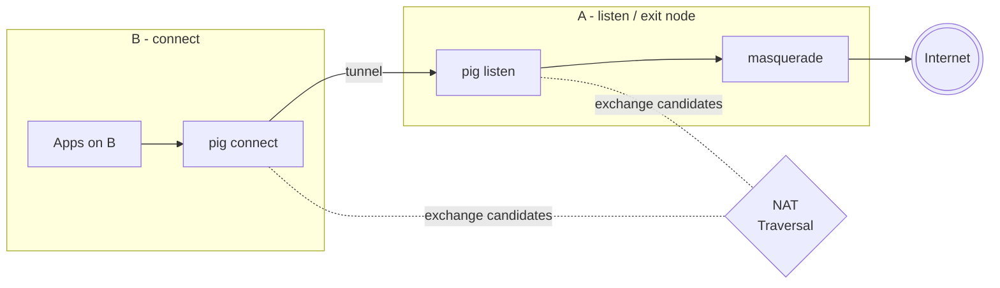

# Exit node

A, the listener node, waits for incoming connections. B is the connecting node.
A and B find a connection path automatically using [NAT traversal](../../docs/nat.md).
B sends all of its traffic through A.
A source NATs (or masquerades) B's traffic exiting A's local domain.



## Roles

| Node | Config | Role |
|------|--------|------|
| **A** | [`pig.A.toml`](pig.A.toml) | Listen / exit node (needs IP forwarding + masquerade) |
| **B** | [`pig.B.toml`](pig.B.toml) | Connect client with full-tunnel routes via A |

Use the **same** signaling `server_id` and `encryption_key` on both sides.

## Run

**A** (exit node). Docker with masquerade is typical:

```bash
# from repo, using the generic compose + this config
cp examples/exit-node/pig.A.toml build/docker/pig.config
cd build/docker
PIG_MASQUERADE=1 PIG_NAT_OIF=eth0 docker compose up --build
```

Or on a Linux host with forwarding and nftables already set up:

```bash
sudo pig -config examples/exit-node/pig.A.toml
```

**B** (client):

```bash
sudo pig -config examples/exit-node/pig.B.toml
```

After the tunnel is up, B’s traffic to goes through A.

## Addresses

| Node | Tunnel IPv4 | Tunnel IPv6 |
|------|-------------|-------------|
| A | `172.31.255.1/24` | `fd8c:0a47:f698::1/64` |
| B | `172.31.254.1/29` | `fde6:c530:8426::/64` |
